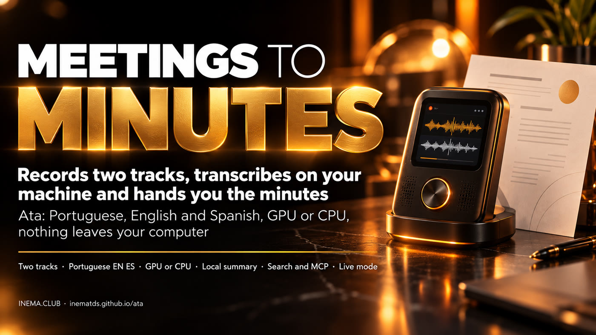

# Ata — meeting notes that never leave your machine

[](https://inematds.github.io/ata/guia/en/)

**🇧🇷 [Português](README.md) · 🇺🇸 [English](README.en.md) · 🇪🇸 [Español](README.es.md)**

## 📖 User guide

Full guide (landing + step by step): **https://inematds.github.io/ata/guia/en/**

---

**Ata** records your meeting on **two tracks**: what you hear (Meet, Zoom, Teams, YouTube) and what you say. It then transcribes on your own machine, in **Portuguese, English or Spanish**, and delivers a Markdown note with every line attributed to a speaker. It also produces a summary, decisions and action items with an owner. No bot joins the call, no account is needed, and the audio never leaves the computer.

- **License:** MIT. Open INEMA project.
- **Inspiration:** the ideas of [CrunchLog](https://www.skool.com/aiautomationsbyjack), by Christian Landsteiner (two tracks, "the microphone is you", the recording as the source of truth). Ata is an **independent implementation**: no line of CrunchLog code was used.
- **Status:** 0.1.0. All phases are implemented and tested with simulated engines. The real engines (NeMo-Speech.cpp on the GPU, onnx on the CPU, Ollama) are implemented but **have not been measured in this version yet** (see [Status and limits](#status-and-limits)).

## What it does

| Feature | How |
|---|---|
| **Two tracks, no driver** | Linux: PipeWire (`pw-record`). Windows: WASAPI loopback. macOS: Swift helper with *process tap* (14.2+, source code in `helpers/macos/`) |
| **Microphone = you** | Everything that comes from the microphone is "Me". The *gate* removes the speaker echo from the microphone, and speaker separation only works on the other side |
| **pt-BR, EN, ES** | Engine, filler-word cleanup ("né", "tipo"; "um", "uh"; "este", "o sea"), note, summary, demo and prep, all per language |
| **GPU or CPU** | Main engine: NeMo-Speech.cpp (Parakeet v3 + Nemotron, CUDA on the DGX Spark/GB10, Metal on the Mac, CPU elsewhere). In-process fallback: onnx-asr + sherpa-onnx |
| **Local summary** | Ollama by default (JSON with summary, topics, decisions, action items with owner and due date, questions). Optional: `claude` or `codex` through your subscription |
| **Search and questions** | SQLite index (FTS5 + vectors) across all meetings. `ata ask` answers with a `[meeting, mm:ss]` citation |
| **Prep** | `ata prep "client"` builds the agenda with open action items, decisions and questions; the items check themselves off in the next meeting |
| **Recognize voices** | Optional and off by default: enrolls a person's voice and "Speaker 2" becomes "Ana" in later meetings |
| **Second brain** | `ata connect cerebro --dir ...` writes the meeting to `fontes/` and decisions to `decisoes/registro.md`. Obsidian and Agentic OS are also supported |
| **Live mode** | Local transcription during the call (Nemotron 3.5 streaming), with the agenda checking itself off, no paid service |
| **Agents** | MCP server (`ata mcp`), skills and Claude Code plugin |
| **Dashboard** | `ata dashboard`: record, listen, clickable transcript, rename speakers, search and live mode (PT/EN/ES) |
| **CrunchLog compatible** | Reads CrunchLog recordings (`bundle_version: 2`) without changing the originals |

## Install

```bash
# 1. uv (Python manager)
curl -LsSf https://astral.sh/uv/install.sh | sh                      # Linux/macOS
# powershell -ExecutionPolicy ByPass -c "irm https://astral.sh/uv/install.ps1 | iex"   # Windows

# 2. Ata (with MCP, live mode and CPU engine)
git clone https://github.com/inematds/ata && cd ata
uv tool install --python 3.12 ".[mcp,live,onnx]"

# 3. Configure (language, folders, summary)
ata setup --lang pt-BR --summary ollama

# 4. Transcription engine (detects the GPU: cuda13 on the GB10, metal on the Mac, cpu elsewhere)
ata engine install --dry-run            # shows what will be downloaded
ata engine install --allow-unverified   # in this version the hashes are not pinned yet
ata engine start

# 5. Check
ata doctor
```

## Use

```bash
ata demo --lang pt-BR                  # made-up meeting → note (with Piper; --no-tts for no voice)
ata toggle                             # starts recording; again to stop and generate the note
ata start --title "Kickoff Acme" --speakers 3 --lang pt-BR
ata stop
ata import gravacao.mp4 --lang es      # audio/video you already have
ata process <recording> --speakers 4   # reprocess
ata speakers <recording> "Speaker 2=Ana" "Speaker 3=Bruno"
ata export <recording> --format srt    # srt|vtt|txt|json|md|csv
ata search "beta deadline" --since 30d
ata ask "what did we decide about the launch?"
ata actions --owner Ana
ata prep "acme" --calendar "Thu 2pm, Ana and Bruno"
ata voices enroll Ana <recording> "Speaker 2"   # optional (needs voices.enabled = true)
ata connect cerebro --dir ~/meu-cerebro
ata live start                         # live mode during recording
ata dashboard                          # http://127.0.0.1:47530/
ata mcp                                # MCP server for Claude Code / Codex
ata privacy <recording>                # which engines and destinations touched this meeting
ata bench asr --set <folder> --engines nemo,onnx --lang pt-BR   # WER and speed
```

Keyboard shortcut: bind `ata toggle` to a key (GNOME/KDE, PowerToys/AutoHotkey, macOS Shortcuts or Stream Deck).

**MCP in Claude Code:** `claude mcp add --scope user ata -- ata mcp`. The plugin with the skills (`meeting-notes`, `action-items`, `meeting-prep`, `ask-meetings`, `meeting-to-wiki`) is in `.claude-plugin/` and `skills/`.

## How it works

```
hotkey / dashboard / MCP
   │
   ▼  recording (PipeWire · WASAPI · macOS helper) → meeting folder (ata/1 bundle)
far.wav (what you hear) + mic.wav (you) + meta.json (clock, language, engines)
   │
   ▼  ata process (all local)
ASR per track and language → a single time-alignment point → gate removes echo from mic
→ speaker separation of far (+ optional mic) → voiceprints (optional) → turns
→ per-language cleanup + glossary → JSON summary (Ollama | claude | codex)
→ nota.md (bundle + notes folder) → search index → second brain / Obsidian
```

Full contract: [`docs/CONTRATO.md`](docs/CONTRATO.md). Interfaces between modules: [`docs/INTERFACES.md`](docs/INTERFACES.md).

## Privacy

| Level | What leaves the machine |
|---|---|
| **0 (default)** | Nothing. Transcription, speaker separation, summary (Ollama), search and live mode all run locally |
| **1 (subscription)** | Only transcript text, never audio, to Anthropic or OpenAI via `claude -p` or `codex exec`, with tools turned off. Requires `privacy.level = 1` |

No module calls a paid API. Logs and errors never contain meeting text. Voiceprints stay only on your machine and can be deleted (`ata voices forget --all`).

## Status and limits

- **Tests:** suite with over 400 tests, with no network and no models (simulated engines). Real recording through PipeWire was tested on Linux.
- **Not measured in this version yet:** performance and quality of the real engines (NeMo-Speech.cpp, onnx, Ollama). The NeMo-Speech.cpp API follows what is documented in `src/ata/engines/nemo.py`. The download verification hashes are empty in `src/ata/data/models.toml`, which is why installation requires `--allow-unverified`.
- **macOS:** the Swift helper exists as source code; it has not been compiled or tested yet.
- **Windows:** capture implemented; not tested on a real machine in this version.

## Development

```bash
uv sync --all-groups
uv run pytest -q                       # default suite (no network, no models)
uv run pytest -q -m linux_audio        # real recording via PipeWire
```

## Credits

Inspired by the ideas of CrunchLog (Christian Landsteiner). Models: NVIDIA Parakeet / Nemotron (NeMo-Speech.cpp), pyannote and WeSpeaker via sherpa-onnx, Ollama. Research and architecture proposal: `docs/` and INEMA's `crunchlog` project.
